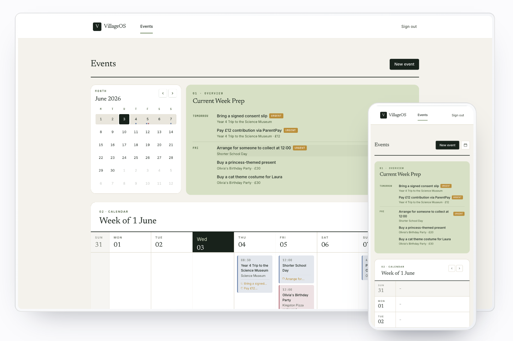
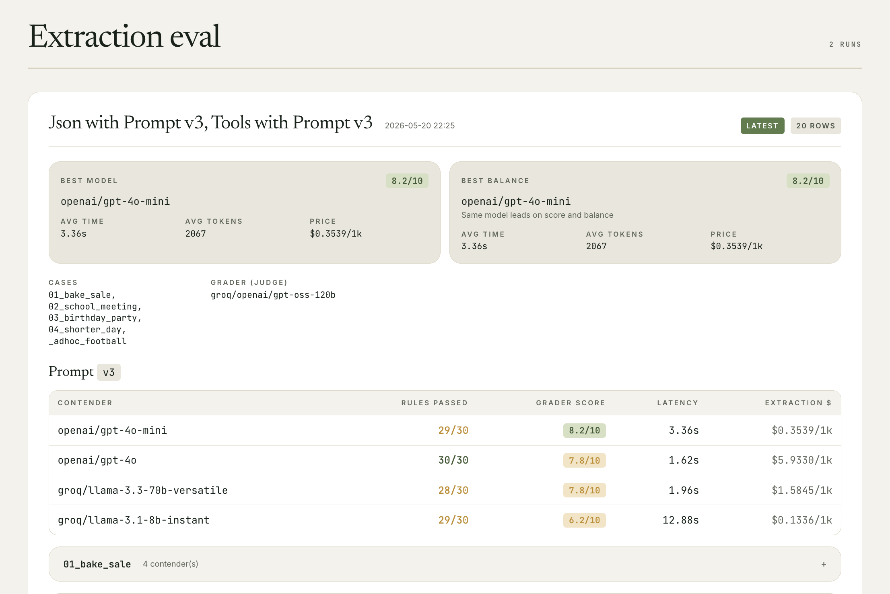
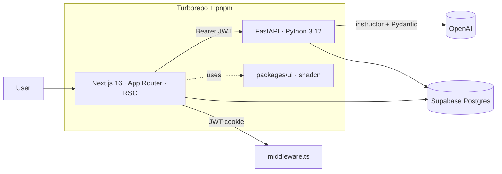

# VillageOS

> An AI family operating system that turns messy parent communications —
> WhatsApp threads, PDF newsletters, flyer photos — into structured,
> schema-valid calendar events with action items and confidence scores.

[](https://github.com/AdamMrotek/VillageOS/actions/workflows/ci.yml)
[](https://villageos.co.uk/sign-in)
[](https://eep5cd3mp0.execute-api.eu-north-1.amazonaws.com/docs)
[](./ADL.md)

**Live demo:** https://villageos.co.uk
**Live API:** https://eep5cd3mp0.execute-api.eu-north-1.amazonaws.com/docs (Swagger)

## Screenshots & demo

> Assets live in [`docs/media/`](./docs/media).

**The app — desktop & mobile**



**Eval results**



**Happy-path walkthrough** (paste → extraction → calendar event):

https://github.com/user-attachments/assets/db10485a-22a0-4761-9930-797e677a1747


---

## Why this project

Parents drown in unstructured information: school WhatsApp threads, PDF
newsletters, paper flyers brought home in a backpack. The interesting
problem isn't the calendar UI — it's reliably turning that mess into
trustworthy structured data without hallucinating dates, locations, or
action items.

VillageOS is that problem treated as a real product. It's also a
deliberate place to practise the parts of full-stack work that get
harder once an LLM is in the request path: schema-valid output,
eval-driven development, cross-language typed contracts, and keeping a
model-backed endpoint observable in production.

---

## Engineering at a glance

- **Typed end-to-end across two languages.** Pydantic v2 schemas on the
  API mirror TypeScript types on the web; a Supabase JWT bridges
  `@supabase/ssr` cookies on Next.js and `PyJWT` (asymmetric RS256/ES256
  via JWKS) on FastAPI, with RLS enforced via a JWT-scoped Supabase
  client.
- **Structured LLM output, not vibes.** `instructor` + Pydantic enforces
  the `ParentEvent` contract (title, type, start_time, action_items,
  confidence, source_text) on every extraction.
- **Eval harness with a golden dataset.** Messy real-world inputs run
  as a parameterised matrix across providers, models, prompt versions,
  and instructor modes; per-field pass/fail, latency, and cost-per-1k
  tracked in an append-only log. See [Evaluation](#evaluation).
- **Architecture documented as it's built.** Numbered ADRs in
  [`ADL.md`](./ADL.md) record the trade-offs (monorepo, FastAPI vs Next
  API routes, Tailwind v4, shared `packages/ui`, …).
- **Infrastructure discipline.** SQL migrations checked into git
  (`supabase/migrations/`), strict pnpm workspaces, Turborepo cache,
  CORS allowlist, no secrets in the client bundle.

---

## Architecture



---

## Evaluation

Reliable LLM output is the actual product risk. VillageOS treats
extraction quality as a tested contract, not a vibe.

- **Golden dataset** of real parent messages in
  [`apps/api/tests/golden/`](./apps/api/tests/golden) with field-level
  expectations: `event_type`, `start_time` / `start_date` (±30 min
  tolerance), `is_all_day`, action-item keyword coverage, confidence
  floor.
- **Frozen "today"** in every run so relative dates ("next Saturday")
  evaluate deterministically.
- **Append-only run log** in
  [`evals/extraction/results.jsonl`](./apps/api/evals/extraction/results.jsonl)
  capturing prompt version, instructor mode, model, tokens, latency,
  cost-per-1k, and per-field pass/fail for every run.
- **Per-provider instructor modes** (OpenAI → TOOLS, Groq → JSON) and the
  frozen-`today` harness are documented in
  [`apps/api/EVALS.md`](./apps/api/EVALS.md).
- **Eval viewer** lives in the admin app (`apps/admin`) at `/evals` — a browsable
  pass/fail matrix of runs, plus a **Golden set** tab showing each case's input
  text and expected result. Served by the admin-gated `/api/admin/evals/*`
  endpoints.

### Model selection — current findings

Full analysis in
[`model_selection.md`](./apps/api/evals/extraction/model_selection.md).
Production-quality candidates:

| Provider/Model | Mode | Pass rate | Latency | Cost / 1k | Role |
|---|---|---|---|---|---|
| `groq/llama-4-scout-17b` | JSON | 4/4 | **0.71s** | **$0.25** | Fastest viable + cheapest |
| `openai/gpt-4o-mini` | TOOLS | 4/4 | 2.20s | $0.27 | Default fallback |
| `groq/openai/gpt-oss-20b` | JSON | 4/4 | 1.02s | $0.56 | Backup if scout regresses |
| `openai/gpt-4o` | TOOLS | 4/4 | 1.50s | $5.17 | Use only when mini fails |

**Date extraction is the discriminator.** Title, type, and action items
pass on every model in the matrix; the differences are almost entirely
about whether the model gets `start_time` right on relative-date inputs
like *"next Saturday."* Several otherwise-capable models
(`llama-3.3-70b`, `qwen3-32b`, `llama-3.1-8b`) silently fail this case
— exactly the kind of regression a golden eval catches and ad-hoc
testing misses.

### Reproduce

```bash
cd apps/api
python -m evals.extraction.run                 # full matrix, current prompt, append to results.jsonl
python -m evals.extraction.run \
  --models openai/gpt-4o-mini \
  --cases _adhoc_football \
  --no-append                                  # one model, one case, print only
```

---

## Stack

| Layer | Tech |
|---|---|
| Web | Next.js 16 (App Router, RSC), React 19, TypeScript, Tailwind v4, shadcn/ui, TanStack Query, Zustand |
| API | FastAPI, Pydantic v2, `instructor`, OpenAI SDK, PyJWT |
| Data | Supabase Postgres, SQL migrations, `pgvector` (Phase 2) |
| Tooling | Turborepo, pnpm workspaces, pytest + golden evals |
| Planned | MCP TypeScript SDK server, WhatsApp / email ingestion workers |

---

## Roadmap

- **Phase 1 — PoC (shipped):** `/api/v1/extract`, event preview UI,
  golden-dataset evals, Supabase auth.
- **Phase 2:** `pgvector` RAG over provider profiles, calendar view,
  iCal export.
- **Phase 3:** Email/WhatsApp ingestion, daily Morning Brief worker,
  deployed MCP server.

Full PRD: [`PRD.md`](./PRD.md) · Decisions: [`ADL.md`](./ADL.md)

---

## Quick start

```bash
pnpm install
cp apps/web/.env.local.example apps/web/.env.local
cp apps/api/.env.example       apps/api/.env

cd apps/api && python -m venv .venv && source .venv/bin/activate
pip install -r requirements.txt && cd ../..

pnpm dev    # Next.js :3000 · FastAPI :8000 · /docs at :8000/docs
```

More: [`DEVELOPMENT.md`](./DEVELOPMENT.md) · [`FRONTEND.md`](./FRONTEND.md) · [`BACKEND.md`](./BACKEND.md) · [`DATABASE.md`](./DATABASE.md) · [`AUTH.md`](./AUTH.md) · [`PROVIDERS.md`](./PROVIDERS.md) · [`INTEGRATIONS.md`](./INTEGRATIONS.md)
