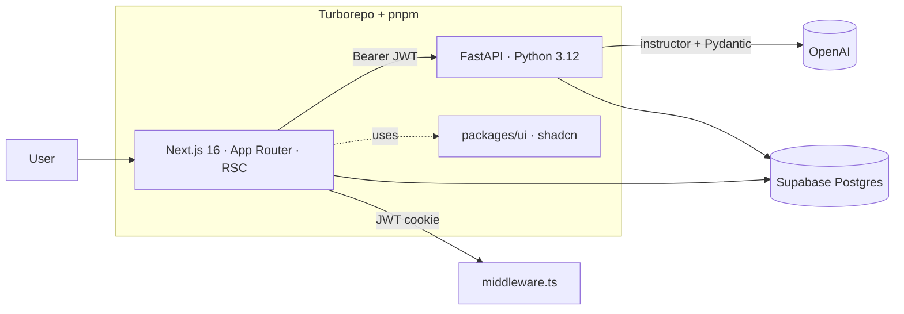

# VillageOS

> An AI family operating system that turns messy parent communications —
> WhatsApp threads, PDF newsletters, flyer photos — into structured,
> schema-valid calendar events with action items and confidence scores.

[](https://village-os-web.vercel.app/sign-in)
[](./ADL.md)

**Live demo:** https://village-os-web.vercel.app/sign-in


---

## Why this project

Parents drown in unstructured information: school WhatsApp threads, PDF
newsletters, paper flyers brought home in a backpack. The interesting
problem isn't the calendar UI — it's reliably turning that mess into
trustworthy structured data without hallucinating dates, locations, or
action items.

VillageOS is that problem treated as a real product. It's also a
deliberate place to practise the parts of full-stack work that get
harder once an LLM is in the request path: schema-valid output,
eval-driven development, cross-language typed contracts, and keeping a
model-backed endpoint observable in production.

---

## Engineering at a glance

- **Typed end-to-end across two languages.** Pydantic v2 schemas on the
  API mirror TypeScript types on the web; a Supabase JWT bridges
  `@supabase/ssr` cookies on Next.js and `PyJWT` (HS256) on FastAPI.
- **Structured LLM output, not vibes.** `instructor` + Pydantic enforces
  the `ParentEvent` contract (title, type, start_time, action_items,
  confidence, source_text) on every extraction.
- **Eval harness with a golden dataset.** Ten real-world messy inputs
  run under `pytest` — regressions in extraction quality fail the
  build, not the user.
- **Architecture documented as it's built.** Numbered ADRs in
  [`ADL.md`](./ADL.md) record the trade-offs (monorepo, FastAPI vs Next
  API routes, Tailwind v4, shared `packages/ui`, …).
- **Infrastructure discipline.** SQL migrations checked into git
  (`supabase/migrations/`), strict pnpm workspaces, Turborepo cache,
  CORS allowlist, no secrets in the client bundle.

---

## Architecture



---

## Stack

| Layer | Tech |
|---|---|
| Web | Next.js 16 (App Router, RSC), React 19, TypeScript, Tailwind v4, shadcn/ui, TanStack Query, Zustand |
| API | FastAPI, Pydantic v2, `instructor`, OpenAI SDK, PyJWT |
| Data | Supabase Postgres, SQL migrations, `pgvector` (Phase 2) |
| Tooling | Turborepo, pnpm workspaces, pytest + golden evals |
| Planned | MCP TypeScript SDK server, WhatsApp / email ingestion workers |

---

## Roadmap

- **Phase 1 — PoC (shipped):** `/api/v1/extract`, event preview UI,
  golden-dataset evals, Supabase auth.
- **Phase 2:** `pgvector` RAG over provider profiles, calendar view,
  iCal export.
- **Phase 3:** Email/WhatsApp ingestion, daily Morning Brief worker,
  deployed MCP server.

Full PRD: [`PRD.md`](./PRD.md) · Decisions: [`ADL.md`](./ADL.md)

---

## Quick start

```bash
pnpm install
cp apps/web/.env.local.example apps/web/.env.local
cp apps/api/.env.example       apps/api/.env

cd apps/api && python -m venv .venv && source .venv/bin/activate
pip install -r requirements.txt && cd ../..

pnpm dev    # Next.js :3000 · FastAPI :8000 · /docs at :8000/docs
```

More: [`DEVELOPMENT.md`](./DEVELOPMENT.md) · [`FRONTEND.md`](./FRONTEND.md) · [`BACKEND.md`](./BACKEND.md) · [`DATABASE.md`](./DATABASE.md)
